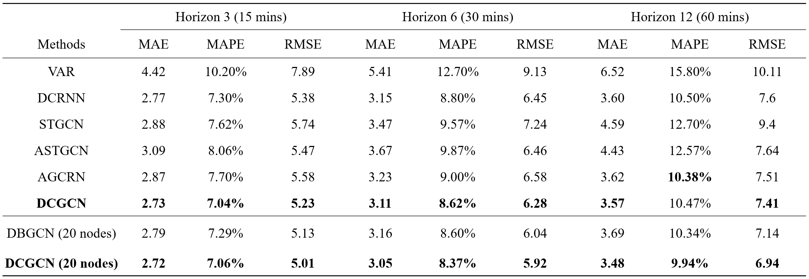
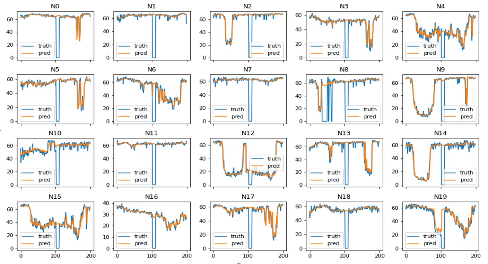

# Dynamic Causal Graph Convolutional Network for Traffic Prediction

This repository contains the official implementation for the paper Dynamic Causal Graph Convolutional Network for Traffic Prediction (CASE-23).

## Requirements

```
torch~=1.12.1
numpy~=1.22.4
tqdm~=4.64.0
matplotlib~=3.5.3
yaml~=0.1.6
pyyaml~=6.0
igraph~=0.10.2
networkx~=2.8.5
scikit-learn~=0.24.2
pandas~=1.2.4
```

The dependencies can be installed by:

```
pip install -r requirements.txt
```

## Data

- METR-LA. This traffic dataset contains traffic flow records collected from loop detectors in the highway of Los Angeles County. There are four months of data ranging from Mar 1st, 2012 to Jun 30th, 2012 collected at 207 sensors for the experiment. 

Remark: 
- To save the size of the repository, we only provide the processed METR-LA dataset with the 20 nodes in `./data/METR-LA`
- You can download the original METR-LA data from https://pan.baidu.com/s/14Yy9isAIZYdU__OYEQGa_g. The original dataset could be preprocessed for model training by

```
python data_preprocess.py --traffic_df_filename <file path of original h5 file> --output_dir <folder path of the preprocessed dataset>
```

## Usage
1. Set the value of `base_dir` in `./utils/path_utils` as the current work directory
2. To train the causal structure learning hyper network: 
    - Change the hyperparameters in `./data/models/dag_gen/dag_gen_la.yaml` if you need. Remember to set the value of `log_dir` and `dataset_dir`.
    - Run `train_dag_gen.py`
3. To train the downstream dynamic causal traffic prediction network:
    - Change the hyperparameters in `./data/models/pred/pred_la.yaml` if you need. Remember to set the value of `log_dir`, `dataset_dir` and

## Results

<p align="center">

<br><br>
<b>Figure 1.</b>  Traffic Forecasting Performance Comparison For METR-LA.
</p>

<p align="center">

<br><br>
<b>Figure 2.</b> Prediction Results For the First 20 Nodes in METR-LA.
</p>

<p align="center">

<br><br>
<b>Figure 3.</b> Example of Time-Varying DBN Results (Workday Morning).
</p>